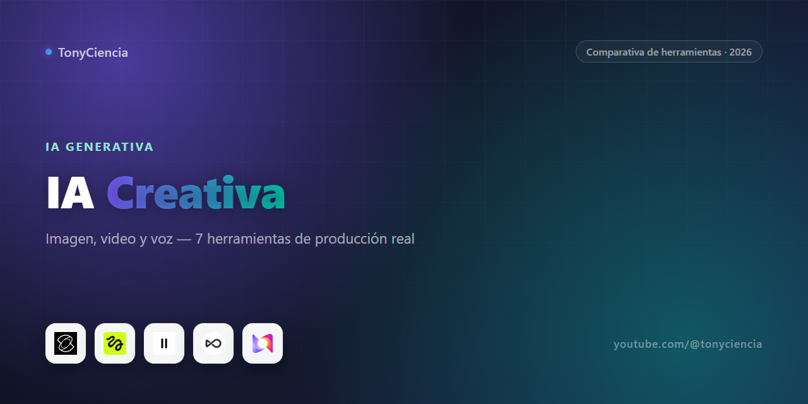

# IA generativa para imagen, video y voz: guía práctica 2026

Hace dos años, "IA generativa" significaba probar una demo rota de un modelo experimental y esperar que no se cayera el servidor. Hoy es infraestructura de producción: hay estudios chicos sacando B-roll que antes hubiera necesitado un rodaje entero, y equipos de marketing generando cientos de variaciones de creativo sin tocar una cámara ni un banco de fotos. El salto no fue "la IA mejoró" en abstracto — fue que cada categoría se especializó. Y ahí está la trampa: como todas usan la misma palabra de moda, es fácil terminar pagando tres suscripciones que hacen el trabajo de una, o peor, ninguna hace bien el trabajo que necesitás porque eran para otra cosa.

Esta guía no intenta cubrir "todas las herramientas de IA creativa que existen" — eso ya es una lista inútil de tan larga. Separa por lo que realmente vas a producir: video generativo, edición de imagen, publicidad, o voz. Si sabés qué necesitás producir, sabés en qué sección mirar.

## Cómo armamos esta comparativa

Esto no es un scan automático ni una lista comprada. Las ocho herramientas de acá son las que TonyCiencia tiene con relación de partner **activa** ahora mismo — a propósito dejamos afuera programas pendientes de aprobación o vencidos, aunque estén en el radar. Eso significa que cada link de abajo corresponde a algo que se probó o se sigue de cerca en el uso real del canal, no a un texto genérico copiado de la página de ventas de cada marca. Es una limitación tanto como un criterio: si tu herramienta favorita no está, probablemente sea porque todavía no forma parte de ese stack activo, no porque la hayamos descartado.

## Comparativa rápida

| | Herramienta | Genera | Link |
|---|---|---|---|
|  | **Kling AI** | Video desde texto o imagen | [Probar →](https://klingaiaffiliate.pxf.io/c/6249333/2780725/31828) |
|  | **Higgsfield** | Video con control de cámara tipo cine | [Probar →](https://goto.higgsfield.ai/c/6249333/2949196/34954) |
|  | **OpenArt AI** | Imagen y video para marcas/ecommerce | [Probar →](https://openartai.pxf.io/c/6249333/3106413/38572) |
|  | **PicWish** | Edición de foto (fondo, retoque) | [Probar →](https://wangxutechnologyhkcolimited.pxf.io/c/6249333/2975463/35512) |
|  | **AdCreative.ai** | Creativos publicitarios listos para pautar | [Probar →](https://free-trial.adcreative.ai/3fn5zxosagaz) |
|  | **Eleven Labs** | Voz — clonación y narración realista | [Probar →](https://try.elevenlabs.io/8w0jtxk54bd0) |
|  | **Murf AI** | Voiceover para video/presentaciones | [Probar →](https://get.murf.ai/e5a3jr17jump) |
|  | **Fish Audio** | Clonación de voz open-source, más barata por volumen | [Probar →](https://fish.audio/?fpr=ai-audiotop) |

---

## Video generativo: dos filosofías distintas

**Kling AI** y **Higgsfield** compiten en el mismo espacio — texto o imagen a video — pero apuntan a públicos distintos. Kling apunta a calidad general y velocidad de iteración: probás variaciones rápido hasta encontrar el clip que sirve, sin pelearte con la herramienta en el camino. Higgsfield se metió más de lleno en el lenguaje de cámara — movimientos, encuadres, efectos VFX — buscando que el resultado se sienta "filmado" en vez de "generado", que es justo el punto donde falla la mayoría de estas herramientas.

Ninguna de las dos reemplaza todavía a una cámara para todo. Pero para B-roll, conceptos, o contenido que directamente antes no se podía producir sin presupuesto de rodaje, ya cruzaron el umbral de "curiosidad" a "vale la pena tenerlas en el flujo real".

## Imagen: de "generar arte" a "producir contenido de marca"

Ese mismo salto de curiosidad a producción es lo que le pasó a **OpenArt AI**: dejó de ser una herramienta para jugar a generar arte y se reposicionó para marcas, marketers y ecommerce que necesitan volumen de imagen consistente — banners, variaciones de producto, contenido para redes en cantidad. **PicWish** juega un partido distinto y más acotado: no genera desde cero, edita lo que ya tenés — quitar fondo, retocar, upscale. Si tu problema concreto es "necesito mil fotos de producto limpias para mañana", PicWish lo resuelve más rápido que pedirle a un generador que las invente desde cero.

## Publicidad: de brief a creativo pauteable

**AdCreative.ai** ataca un problema todavía más puntual que "generar una imagen": la salida no es "algo lindo", es un creativo con formato y estructura pensados específicamente para funcionar en Meta o Google Ads. Si tu cuello de botella real es producir variaciones de anuncios rápido para testear, esta herramienta es más directa que armar ese flujo a mano con un generador genérico y después adaptar cada imagen al formato de la plataforma.

## Voz: clonación vs. narración vs. volumen

El último tramo de la cadena de producción es el audio, y ahí hay tres problemas distintos disfrazados del mismo nombre. **Eleven Labs** es el estándar cuando necesitás que la voz suene indistinguible de una persona real — clonación de voz, doblaje, narración con matices emocionales. **Murf AI** apunta a un caso más específico y menos exigente: voiceover rápido y prolijo para video corporativo o presentaciones, sin necesariamente buscar el máximo realismo posible, sino consistencia y velocidad de producción cuando el objetivo es terminar el video, no ganar un premio de doblaje.

**Fish Audio** entra por un tercer costado: motor de voz de base open-source, con clonación que se acerca bastante a la calidad de Eleven Labs pero a un costo por minuto/carácter bastante más bajo. Tiene sentido cuando el cuello de botella no es la calidad — ya la conseguiste con cualquiera de las dos anteriores — sino el volumen: proyectos que generan muchísimo audio (doblaje de series de videos, audiolibros, contenido en varios idiomas) donde la diferencia de precio por minuto termina pesando más que un matiz extra de realismo.

## Preguntas frecuentes

**¿Kling o Higgsfield para empezar?**
Si nunca probaste video generativo, Kling AI tiene curva de entrada más simple. Higgsfield tiene sentido cuando ya sabés lo que buscás y necesitás control de cámara específico.

**¿PicWish reemplaza a Photoshop?**
No, resuelve tareas puntuales y repetitivas (fondo, retoque, upscale) mucho más rápido. Para edición compleja seguís necesitando una herramienta de diseño completa.

**¿La voz de Eleven Labs se nota que es IA?**
En la mayoría de los casos de uso (narración, doblaje, contenido) no, sobre todo con las voces clonadas de buena calidad. Para casos muy exigentes (actuación con matices complejos) todavía hay diferencia perceptible, pero cada vez menos.

**¿Cuándo conviene Fish Audio en vez de Eleven Labs?**
Cuando el volumen de audio que necesitás generar es alto y el precio por minuto empieza a pesar en el presupuesto. Para un uso puntual o donde la calidad tiene que ser máxima sin excepción, Eleven Labs sigue siendo la apuesta más segura.

---

### Sobre este repo

Comparativa mantenida por [TonyCiencia](https://youtube.com/@tonyciencia). Los links son de afiliado — no te cuesta nada extra entrar por acá y ayuda a sostener el canal. Solo se listan herramientas con relación de partner activa.

Última actualización: 2026-08-17.
